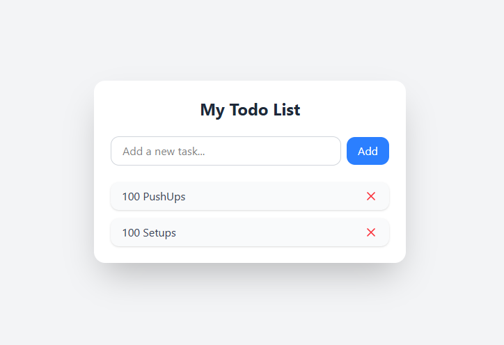

# ✅ React Todo List

A simple and efficient Todo List application built using **React**, **TypeScript**, and **Vite**. This project allows users to add, delete, and manage their daily tasks with ease.

## 🌟 Features

- **Add Tasks**: Easily add new tasks to your todo list.
- **Delete Tasks**: Remove tasks that are no longer needed.
- **Responsive Design**: Optimized for various screen sizes, ensuring usability across devices.
- **Fast Performance**: Leveraging Vite for rapid development and optimized builds.

## 🛠️ Technologies Used

- **React**: A JavaScript library for building user interfaces.
- **TypeScript**: A typed superset of JavaScript that compiles to plain JavaScript.
- **Vite**: A fast build tool and development server.
- **ESLint**: A tool for identifying and fixing problems in JavaScript code.

## 📁 Folder Structure

```
React-Todo-List/
├── public/
│   └── index.html
├── src/
│   ├── components/
│   │   └── TodoItem.tsx
│   ├── App.tsx
│   └── main.tsx
├── .gitignore
├── index.html
├── package.json
├── tsconfig.json
├── vite.config.ts
└── README.md
```

## 🚀 Getting Started

To run this project locally:

1. **Clone the repository**:
   ```bash
   git clone https://github.com/BinodRai123/React-Todo-List.git
   cd React-Todo-List
   ```

2. **Install dependencies**:
   ```bash
   npm install
   ```

3. **Start the development server**:
   ```bash
   npm run dev
   ```

   The application will be available at `http://localhost:5173/`.

## 📸 Screenshots


## 📄 License

This project is licensed under the [MIT License](LICENSE).
